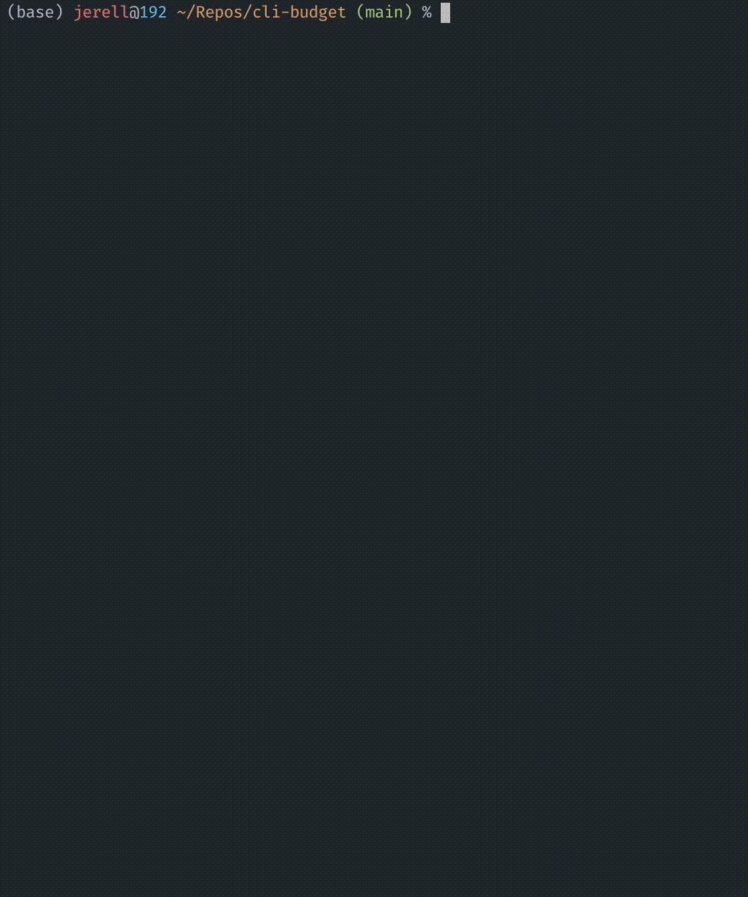

# cli-budget



To install dependencies:

```bash
bun install
```

To run:

```bash
bun .
```

This project was created using `bun init` in bun v1.0.4. [Bun](https://bun.sh) is a fast all-in-one JavaScript runtime.

## Setup

### Google Calendar API

Follow the steps outlined [here](https://developers.google.com/calendar/api/quickstart/nodejs) to get credentials to read your Google Calendar.

1. Create a Google Cloud project.
2. Enable the Google Calendar API
3. Configure OAuth: You want the `calendar.readonly` scope.
4. Put the credentials.json file in this folder

### Google Calendar events

Create events for your income and expenditure with titles in the following format:

`[+£100.00] income`  
`[£100.00] arbitrary text`  
`[£100] arbitrary text`

Income should be marked with a `+`.
